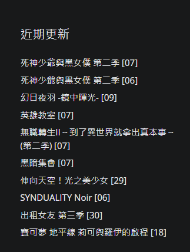

# 查詢最新動漫資訊 HTML版

這個程式是一個使用 Tkinter 建立的 GUI 工具，用於查詢和展示最新的動漫更新資訊。程式會從特 [Anime1.me](https://anime1.me/) 獲取原始碼，並獲取 `動畫名稱` 與 `連結`，以可視化的方式呈現該資料。

## 功能簡介

- 顯示最新動漫更新資訊的清單，包括 `動畫名稱` 和 `連結`。
- 使用者可以透過點擊連結在瀏覽器中開啟相關頁面，以獲取更多資訊。
- 使用者界面友好，能輕鬆查看和點擊動漫連結。

## 如何使用

1. 在終端機或命令提示字元中，執行程式檔案 `anime.py`。

2. 程式視窗將會開啟，顯示一個按鈕 "查看最新動漫"。

3. 點擊按鈕 `查看最新動漫`，程式會從 [Anime1.me](https://anime1.me/) 的【近期更新】獲取最新動漫更新資訊，並將其顯示在程式視窗中。

4. 動漫更新資訊以清單的形式呈現，每筆記錄包括 `動畫名稱` 和 `連結`。

5. 使用者可以 `點擊連結`，程式會在瀏覽器中開啟相關頁面，以獲取更多資訊。

## 範例演示




## 執行要求

- Python 3.x 版本
- Tkinter 庫

## 安裝步驟

1. 使用 `git clone` 命令或下載 ZIP 壓縮檔，將程式複製到您的電腦中。

2. 在命令提示字元中，進入程式所在的資料夾。

3. 執行以下指令，安裝必要的套件：
    ```
    pip install tkinter
    ```

    ```
    pip install urllib3
    ```

    ```
    pip install beautifulsoup4
    ```

4. 執行以下指令，以執行程式：
    ```
    python anime.py
    ```

## 授權資訊

這個程式遵循 [MIT 授權](LICENSE.txt)，您可以自由使用、修改和分享這個程式。